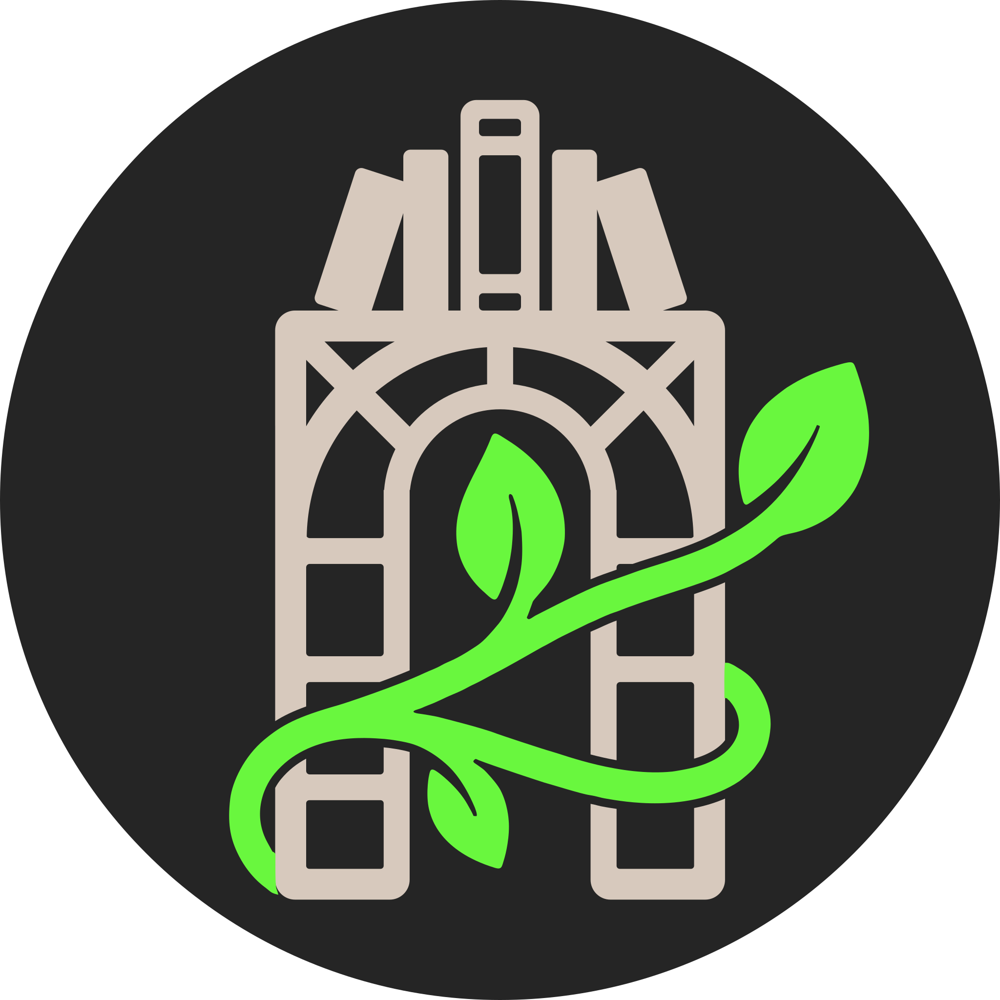

<p align="center">
    
</p>

# trellis

Your open source reading tracker.

> Work in progress.

Track books and reading progress, set reading goals, and organise your library — built as a self-hostable web app.

## Tech stack

- **Backend** — Rust
- **Frontend** — Vue 3, TypeScript, Vite, Tailwind CSS / DaisyUI

## Features

- Book search and detail views
- Reading progress tracking
- Personal library with shelves
- Reading goals

## Getting started

Start the backend:

```sh
cd backend
cargo run
```

Start the frontend dev server:

```sh
cd frontend
pnpm install
pnpm dev
```
